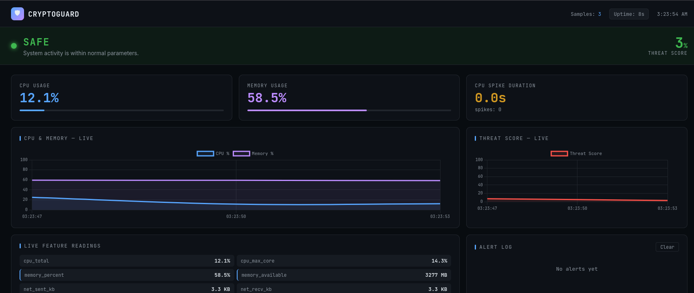
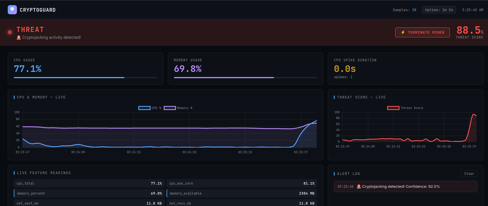
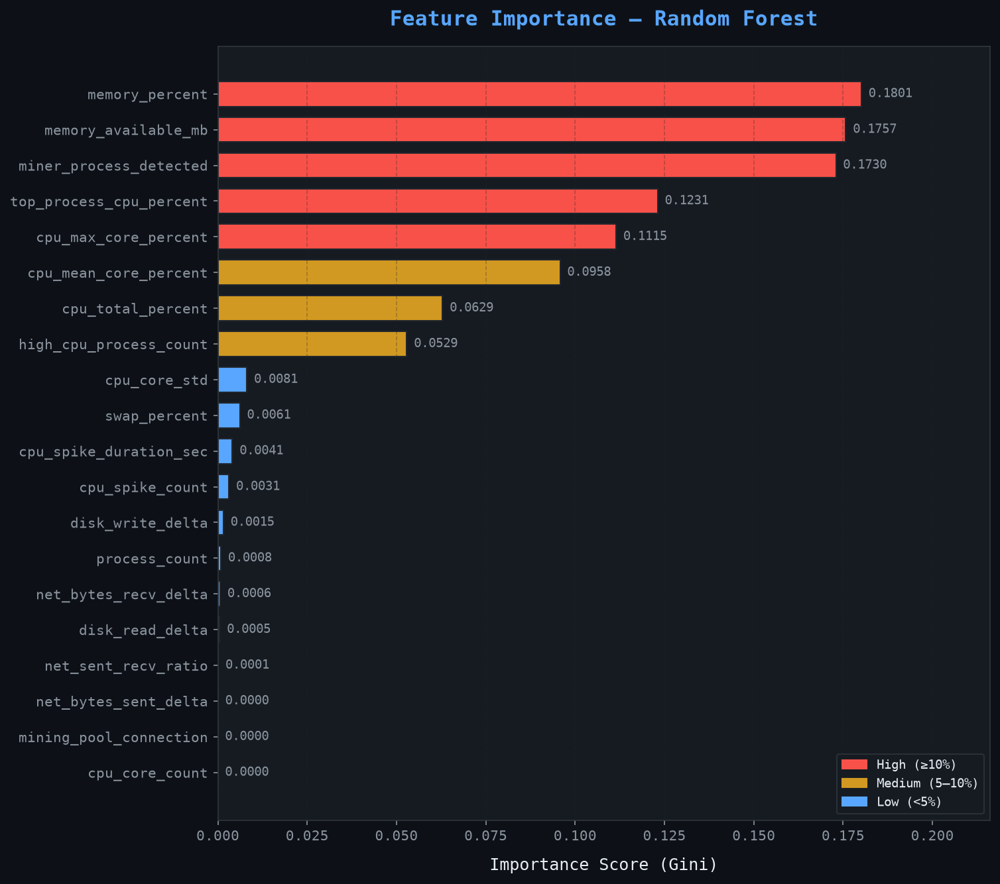
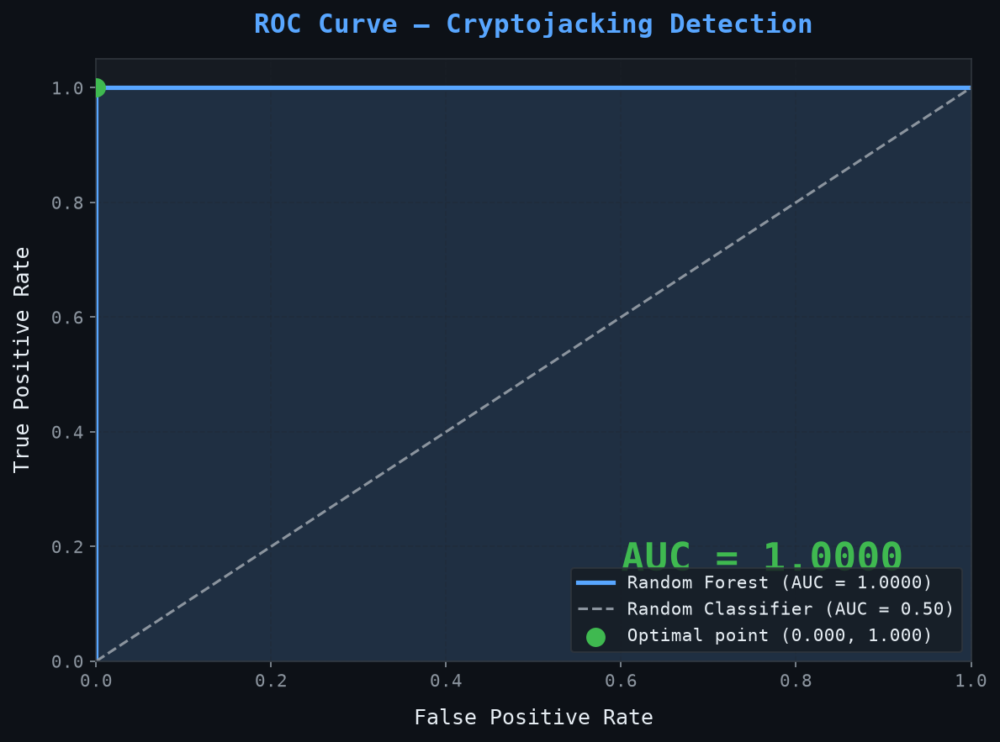

# 🛡️ CryptoGuard — Real-Time Cryptojacking Detection System

> A machine learning-based system that detects cryptojacking attacks in real time by monitoring system behaviour, built as a Final Year Project (FYP) in Computer Science & Engineering.


---

## 📌 What is Cryptojacking?

Cryptojacking is a cyberattack where an attacker secretly runs a cryptocurrency miner on a victim's system — without their knowledge or consent — to earn crypto at the victim's expense. It causes:
- Degraded system performance
- Increased electricity costs
- Hardware wear from sustained CPU/memory load
- Security breaches going undetected

---

## 🎯 Project Overview

CryptoGuard is a complete end-to-end detection pipeline that:

1. **Collects** labelled system behaviour data (normal vs cryptojacking)
2. **Trains** a Random Forest classifier on 22 extracted features
3. **Detects** cryptojacking in real time via a live monitoring dashboard
4. **Responds** by automatically terminating the miner process


## 📸 Screenshots

### Dashboard — Normal State


### Dashboard — Threat Detected


### Dashboard — Threat Detected
.png)

### Feature Importance


### ROC Curve


### Key Research Finding
> Memory-based features (`memory_percent`, `memory_available_mb`) ranked **higher** in importance than CPU features — because XMRig's RandomX algorithm allocates ~2GB RAM. This contradicts most existing literature which focuses primarily on CPU as the detection signal.

---

## 🏗️ System Architecture

```
┌─────────────────────────────────────────────────────────┐
│                    CryptoGuard System                   │
├──────────────┬──────────────────┬───────────────────────┤
│ Data Layer   │  Detection Layer │  Response Layer       │
│              │                  │                       │
│ collect_     │  Random Forest   │  Flask Dashboard      │
│ data_linux   │  (200 trees,     │  + Kill Process       │
│ .py          │  SMOTE, 5-CV)    │  + Alert Log          │
│              │                  │  + Network Veto Rule  │
│ 22 features  │  train_model.py  │  dashboard.py         │
│ 2s intervals │                  │                       │
└──────────────┴──────────────────┴───────────────────────┘
```

---

## 📊 Model Performance

| Metric | Score |
|---|---|
| Accuracy | **100%** |
| Precision | **100%** |
| Recall | **100%** |
| F1 Score | **1.000** |
| CV F1 (5-fold) | **1.000 ± 0.000** |
| ROC AUC | **1.0000** |

### Top 5 Features by Importance

| Rank | Feature | Importance |
|---|---|---|
| 1 | `memory_percent` | 0.1801 |
| 2 | `memory_available_mb` | 0.1757 |
| 3 | `miner_process_detected` | 0.1730 |
| 4 | `top_process_cpu_percent` | 0.1231 |
| 5 | `cpu_max_core_percent` | 0.1115 |

### False Positive Test Results

| Scenario | FP Rate | Result |
|---|---|---|
| CPU Stress (4 cores) | 0.0% | ✅ PASS |
| Memory Stress (1GB) | 0.0% | ✅ PASS |
| CPU + Memory Combined | 100% | ⚠️ Known limitation |
| Disk I/O Stress | 10.0% | ⚠️ Minor noise |
| Fork Bomb (many procs) | 0.0% | ✅ PASS |
| Python Matrix Workload | 0.0% | ✅ PASS |
| Idle Baseline | 0.0% | ✅ PASS |

---

## 🚀 Quick Start

### 1. Clone the Repository
```bash
git clone https://github.com/Chayesh/cryptoguard.git
cd cryptoguard
```

### 2. Set Up Environment
```bash
python3 -m venv venv
source venv/bin/activate
pip install -r requirements.txt
```

### 3. Collect Your Own Data
```bash
# Normal activity (browse, idle, compile)
python3 collect_data_linux.py --label 0 --session "idle" --duration 600 --output normal_data.csv

# Attack simulation (run XMRig in another terminal first)
python3 collect_data_linux.py --label 1 --session "xmrig_full" --duration 600 --output attack_data.csv

# Merge datasets
python3 collect_data_linux.py --merge normal_data.csv attack_data.csv --output full_dataset.csv
```

### 4. Train the Model
```bash
python3 train_model.py --dataset full_dataset.csv
```

Output:
```
results/
├── confusion_matrix.png
├── roc_curve.png
├── feature_importance.png
└── classification_report.txt
```

### 5. Launch the Dashboard
```bash
python3 dashboard.py
# Open browser → http://localhost:5000
```

---

## 📁 Project Structure

```
cryptoguard/
├── collect_data_linux.py   # 22-feature data collector (Kali Linux)
├── train_model.py          # Random Forest training pipeline
├── dashboard.py            # Real-time Flask detection dashboard
├── stress_test.py          # 7-scenario false positive test suite
├── retrain_fix2.py         # Model improvement with memory-heavy data
├── requirements.txt        # Python dependencies
├── results/                # Model evaluation plots
│   ├── confusion_matrix.png
│   ├── roc_curve.png
│   └── feature_importance.png
└── results_v2/             # v1 vs v2 comparison plots
    ├── v1_vs_v2_comparison.png
    └── feature_importance_v1_v2.png
```

---

## 🔧 Features Collected (22 total)

| Category | Features |
|---|---|
| **CPU** | `cpu_total_percent`, `cpu_max_core_percent`, `cpu_mean_core_percent`, `cpu_core_std`, `cpu_core_count`, `cpu_spike_duration_sec`, `cpu_spike_count` |
| **Memory** | `memory_percent`, `memory_available_mb`, `swap_percent` |
| **Network** | `net_bytes_sent_delta`, `net_bytes_recv_delta`, `net_sent_recv_ratio` |
| **Disk** | `disk_read_delta`, `disk_write_delta` |
| **Process** | `process_count`, `top_process_cpu_percent`, `high_cpu_process_count`, `miner_process_detected`, `mining_pool_connection` |

---

## 🖥️ Dashboard Features

- 🔴 **Live status banner** — SAFE / WARNING / THREAT with pulse animation
- 📊 **Real-time charts** — CPU, memory, network, threat score
- 🚨 **Alert log** — timestamped threat detections
- ⚡ **Kill button** — terminate miner process instantly (appears only on THREAT)
- 🛡️ **Veto rule** — network traffic check prevents false positives

---

## 🔁 Model Improvement Pipeline

```
v1 (Baseline)
└── Trained on idle + compiling sessions
└── False positives: 3/7 scenarios

      ↓ Fix 2: Collected memory-heavy normal data
      ↓ Fix 3: Added network veto rule (5KB/s threshold)

v2 (Improved)
└── Retrained with memory-heavy stress sessions
└── False positives: 2/7 scenarios
└── Memory Stress 1GB: 80% FP → 0% FP ✅
```

---

## ⚙️ Tech Stack

| Component | Technology |
|---|---|
| Language | Python 3.10+ |
| ML Model | scikit-learn RandomForestClassifier |
| Imbalance Handling | imbalanced-learn SMOTE |
| Web Dashboard | Flask + Chart.js |
| System Monitoring | psutil |
| Attack Simulator | XMRig (offline benchmark mode) |
| Platform | Kali Linux (VMware) |

---

## ⚠️ Ethical Notice

This project is developed strictly for **academic and educational purposes**.

- XMRig is run in **offline benchmark mode only** (`--bench=1M`) — no actual cryptocurrency is mined
- All data collected on **personally owned systems only**
- Attack simulations performed in an **isolated VM environment**
- This tool is intended for **detection**, not for facilitating attacks

---

## 📄 License

MIT License — see [LICENSE](LICENSE) for details.

---

## 👤 Author

**Chayesh Kumar M L** — CSE Final Year Student  
*Final Year Project — Cryptojacking Detection using Machine Learning*

---

## 🙏 Acknowledgements

- [XMRig](https://github.com/xmrig/xmrig) — open source miner used as attack simulator
- [scikit-learn](https://scikit-learn.org) — ML framework
- [psutil](https://github.com/giampaolo/psutil) — system monitoring library
- [Flask](https://flask.palletsprojects.com) — web dashboard framework
# cryptoguard
